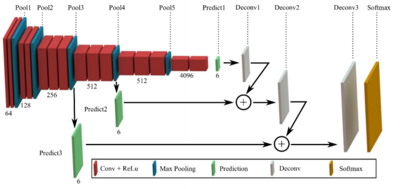

# Cat Detector

This is a skip-layer semantic model built in Keras based on pre-trained VGG16 
with final training on cat images.  The images come from loads in the `data` 
directory.  A real nice data set to train with is the Oxford-IIIT pet data
set constrained to cats ([here](http://www.robots.ox.ac.uk/~vgg/data/pets/)).

### Background

Some papers on the topic of segmentation in general might be:
  
  * [Learning to Segment Every Thing](https://arxiv.org/pdf/1711.10370.pdf)

Some similar concept reference implementations might be:

  * [Deep Learning Tutorial for Kaggle Ultrasound Nerve Segmentation competition, using Keras](https://github.com/jocicmarko/ultrasound-nerve-segmentation)

  * [Kaggle ultrasound nerve segmentation challenge using Keras](https://github.com/raghakot/ultrasound-nerve-segmentation)

  * [NNProject - DeepMask](https://github.com/abbypa/NNProject_DeepMask)

  * [Image Segmentation Keras : Implementation of Segnet, FCN, UNet and other models in Keras](https://github.com/divamgupta/image-segmentation-keras)

### Mechanism of operation

Skip-layer networks are somewhat similar to U-nets for segmentation, but simpler.  Let's
start with a visual of the VGG16 layers as defined in the Keras model:

Here we have the typical full VGG16 model trained on ImageNet with the top end consisting
of fully connected layers.  First, we take the top end off, then we create transpose
convolution layers through the network added together to reinforce features at different
scales. A diagram of the idea would be:

Once the top end is peeled off VGG16 and these connections are added, the summary 
from Keras looks like this:

As you can see, we froze the existing VGG16 convolutional layer weights, as these 
are great, and we have a fairly small number of trainable parameters arising
from our transpose convolution layers.  This means pretty quick training, particularly
since these are near the top end!

### Code
