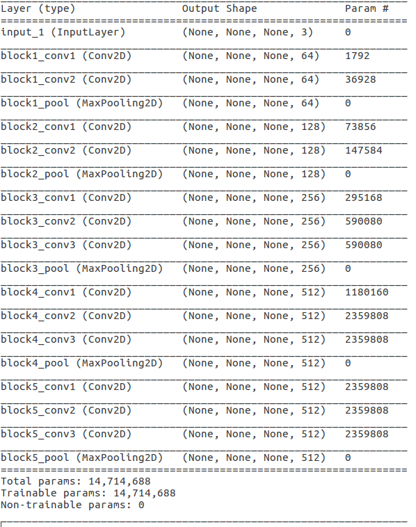
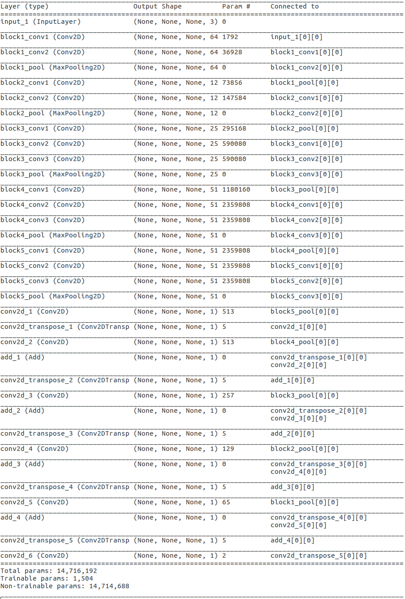

# Pet Image Segmentation in Keras

This is a skip-layer semantic model built in Keras based on pre-trained VGG16 
with final training on pet images.  A real nice data set to train with is the 
Oxford-IIIT pet data set.  Drop the data set into the `/data` directory and 
look in the code to see how it loads it.

### Background

Some papers on the topic of segmentation in general might be:
  
  * [Learning to Segment Every Thing](https://arxiv.org/pdf/1711.10370.pdf)

Some similar concept reference implementations might be:

  * [Deep Learning Tutorial for Kaggle Ultrasound Nerve Segmentation competition, using Keras](https://github.com/jocicmarko/ultrasound-nerve-segmentation)

  * [Kaggle ultrasound nerve segmentation challenge using Keras](https://github.com/raghakot/ultrasound-nerve-segmentation)

  * [NNProject - DeepMask](https://github.com/abbypa/NNProject_DeepMask)

  * [Image Segmentation Keras : Implementation of Segnet, FCN, UNet and other models in Keras](https://github.com/divamgupta/image-segmentation-keras)

### Mechanism of operation

Start with the stock VGG16 trained on ImageNet, excluding the fully connected 
top end since we are not solving a classification problem.  This has a summary 
like this:

Next create transpose convolution layers through the network added together to 
reinforce features at different scales.  This results in a summary like this:

The idea is to freeze the weights of the pre-trained VGG16 convolutional layers 
and only train the new transpose convolution layers.  This yields a model with
a relatively small number of trainable parameters that are all near the top
of the model and consequently quicker to train.  You can make a lot of adjustments
to the capability of the model by altering the particulars of the convolution
layers and transpose convolution layers, which will affect the number of trainable
parameters and the characteristics of the features that will result in the
trained segmentation.  

One thing that is critical is to use a good metric for loss so that the model 
trains well.  This can be accomplished several ways.  

### Code

There is a controller, `main.py`, that uses the classes in `/src`.  The
way it is broken up should be pretty obvious and reasonably easy to extend
should you want to use some other data set.  

