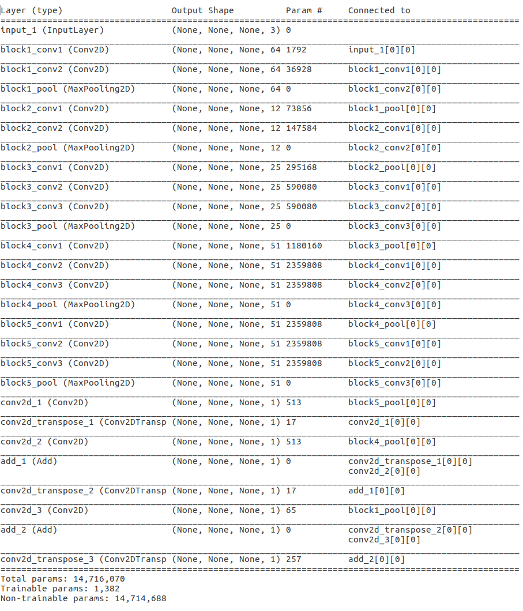

# Pet Image Segmentation in Keras

This is a skip-layer semantic model built in Keras based on pre-trained VGG16 
with final training on pet images.  A real nice data set to train with is the 
Oxford-IIIT pet data set.  Drop the data set into the `/data` directory and 
look in the code to see how it loads it.

### Background

Some papers on the topic of segmentation in general might be:
  
  * [Learning to Segment Every Thing](https://arxiv.org/pdf/1711.10370.pdf)

Some similar concept reference implementations might be:

  * [Deep Learning Tutorial for Kaggle Ultrasound Nerve Segmentation competition, using Keras](https://github.com/jocicmarko/ultrasound-nerve-segmentation)

  * [Kaggle ultrasound nerve segmentation challenge using Keras](https://github.com/raghakot/ultrasound-nerve-segmentation)

  * [NNProject - DeepMask](https://github.com/abbypa/NNProject_DeepMask)

  * [Image Segmentation Keras : Implementation of Segnet, FCN, UNet and other models in Keras](https://github.com/divamgupta/image-segmentation-keras)

### Mechanism of operation

We start with the stock VGG16 trained on ImageNet including the fully connected 
top layers.  This has a summary like this:

Here we have the typical full VGG16 model trained on ImageNet with the top end consisting
of fully connected layers.  First, we take the top end off, then we create transpose
convolution layers through the network added together to reinforce features at different
scales.  This results in a summary like this:

The idea is to freeze the weights of the pre-trained VGG16 convolutional layers since
these already are quite good at feature selection across a wide range of features of
varying scale.  What we do is train the new transpose convolution layers so that we
can make use of them for showing what regions have the features related to the 
segmentation we want.  As you can see, the number of trainable parameters is actually
fairly small.  Moreover, these trainable parameters are all at the top end of the 
model, so we don't have to backpropogate all that much to train it.  This is one of the 
reasons the skip-layer approach to segmentation trains quickly.  The real value is in
being able to take advantage of the pre-trained VGG16 model.

There are a lot of variations on this general idea, as is obvious looking at some
of the links mentioned above.  One thing that is critical is to use a good metric
for loss so that the model trains well.

### Code

There is a controller, `main.py`, that uses the classes in `/src`.  The
way it is broken up should be pretty obvious and reasonably easy to extend
should someone want to use some other data set.

